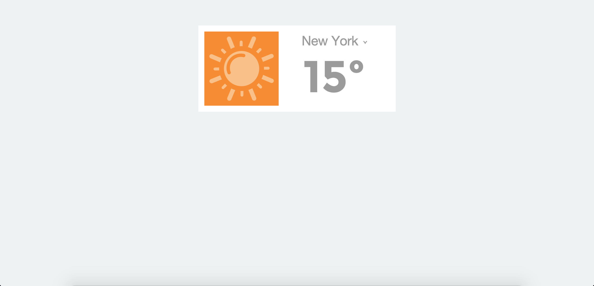

# Weather App

Weather app is a one page application that brings in the weather (the temperature & a relevant icon) via an api for a selection of cities.

## Objectives
To understand & use apis.

This was my first introduction to apis and how data brought in from them can be manipulated.

## Screenshots
<div align="center">
  
</div>

## Technology
- jQuery
- HTML
- CSS

## To Run
```
$ git clone https://github.com/katebeavis/weather_app.git
$ cd weather-app
$ open index.html
```
